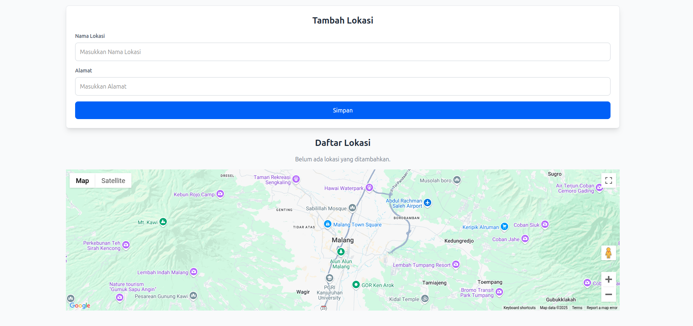

# Aplikasi Manajemen Lokasi dengan Google Maps 🌍

[](https://react.dev/)
[](https://nodejs.org/)
[](https://www.mongodb.com/)
[](LICENSE)

Aplikasi web untuk manajemen lokasi dengan integrasi peta Google Maps secara real-time.



## Daftar Isi 📚
- [Fitur Utama](#fitur-utama-%e2%9c%a8)
- [Teknologi](#teknologi-%f0%9f%9b%a0%ef%b8%8f)
- [Instalasi](#instalasi-%f0%9f%93%a5)
- [Konfigurasi](#konfigurasi-%f0%9f%94%a7)
- [Struktur Project](#struktur-project-%f0%9f%93%82)
- [Endpoint API](#endpoint-api-%f0%9f%93%a1)
- [Troubleshooting](#troubleshooting-%f0%9f%9a%a8)
- [Lisensi](#lisensi-%f0%9f%93%84)

## Fitur Utama ✨
- 🌍 Tambah lokasi baru dengan pin di peta
- ✏️ Edit & hapus lokasi yang ada
- 🔍 Auto-complete alamat menggunakan Google Places API
- 📱 Tampilan responsif (Desktop & Mobile)
- ✅ Validasi input form
- ⚡ Pembaruan peta secara real-time
- 🗑️ Konfirmasi penghapusan data

## Teknologi 🛠️
**Frontend:**
- React.js + Vite
- Tailwind CSS
- Google Maps JavaScript API
- Axios
- React Hot Toast

**Backend:**
- Node.js
- Express.js
- MongoDB
- Mongoose

## Instalasi 💅

### Prasyarat
- Node.js v18+
- MongoDB v6+
- Akun Google Cloud Platform

### Langkah 1: Clone Repository
```bash
git clone https://github.com/username-anda/google-maps-crud.git
cd google-maps-crud
```

### Langkah 2: Setup Backend
```bash
cd backend
npm install
```

Buat file `.env`:
```env
MONGO_URI=your_mongodb_connect_here
PORT=5000
```

Jalankan server:
```bash
npm start
```

### Langkah 3: Setup Frontend
```bash
cd ../frontend
npm install
```

Buat file `.env`:
```env
VITE_GOOGLE_MAPS_API_KEY=your_api_key_here
VITE_GOOGLE_MAPS_MAP_ID=your_map_id_here
VITE_BACKEND_URL=http://localhost:5000
```

Jalankan aplikasi:
```bash
npm run dev
```

## Konfigurasi 🔧

### Google Maps API
Aktifkan layanan berikut di Google Cloud Console:
- Maps JavaScript API
- Places API
- Geocoding API

Buat API Key dengan restriksi:
- **Tipe Aplikasi:** Web
- **Domain:** `localhost:5173/*`


### Database
- MongoDB akan membuat database `location-manager` otomatis
- Collection `locations` akan dibuat saat pertama kali menambah data

## Struktur Project 📂
```
google-maps-crud/
├── backend/
│   ├── models/       # Skema database
│   │   └── Location.js
│   ├── routes/       # Endpoint API
│   │   └── locationRoutes.js
│   ├── server.js     # Server utama
│   └── .env          # Konfigurasi environment
└── frontend/
    ├── src/
    │   ├── components/ # Komponen UI
    │   │   ├── LocationForm.jsx
    │   │   ├── LocationList.jsx
    │   │   └── Map.jsx
    │   ├── App.jsx    # Komponen utama
    │   └── main.jsx   # Entry point
    ├── .env           # Konfigurasi frontend
    └── vite.config.js # Styling
```

## Endpoint API 📁
| Method | Endpoint             | Deskripsi         |
|--------|----------------------|-------------------|
| POST   | `/api/locations`     | Tambah lokasi     |
| GET    | `/api/locations`     | Ambil semua lokasi|
| PUT    | `/api/locations/:id` | Update lokasi     |
| DELETE | `/api/locations/:id` | Hapus lokasi      |

## Troubleshooting 🚨

### Peta Tidak Muncul:
- Pastikan API Key dan Map ID valid
- Cek kuota API di Google Cloud Console
- Verifikasi billing account aktif

### Database Error:
```bash
# Periksa status MongoDB
sudo systemctl status mongod

# Restart service MongoDB
sudo systemctl restart mongod
```

### Error CORS:
```javascript
// Di backend/server.js
app.use(cors({
  origin: 'http://localhost:5173', // Pastikan port sesuai
  methods: ['GET', 'POST', 'PUT', 'DELETE']
}));
```

### Git Conflict:
```bash
# Jika ada error saat push
git pull origin main --allow-unrelated-histories
git push -f origin main
```

## Lisensi 📄
Proyek ini dilisensikan di bawah MIT License - Lihat file LICENSE untuk detail lengkap.


Jika menemukan bug atau ingin berkontribusi, silakan buka issue.
